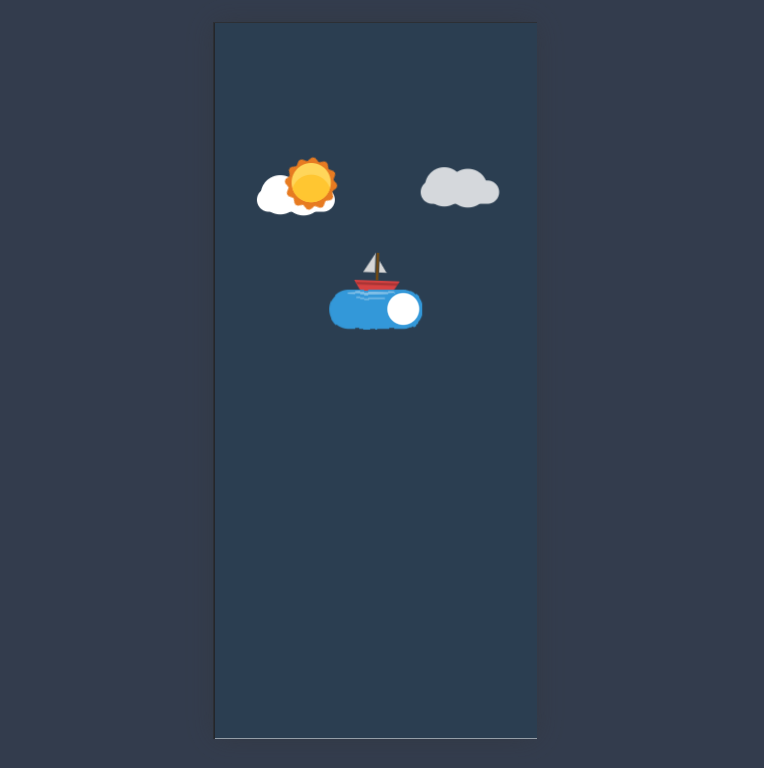

# 🌤️Weather App

This project is a weather app built using simple HTML, CSS, and JavaScript. It provides users with real-time weather information. ☀️🌧️

## 📌 Features
- 🔍 Search for weather information by city name
- 🌤 Show weather conditions in a graphical form
- 🌡 Display temperature, wind speed, and humidity
- 📱 Mobile-friendly design
- 🎨 Beautiful and minimalistic UI design

### 📱 Mobile version:

### 💻 Desktop version:

## 🚀 Technologies
- 🏗 HTML
- 🎨 CSS
- 🚀 JavaScript

## 💡 Usage
1. 🔎 Enter the city name in the search field.
2. ▶️ Click the "Search" button.
3. 📊 The weather information will be displayed on the screen.
---
If you like the project, don't forget to give it a ⭐! 🚀
